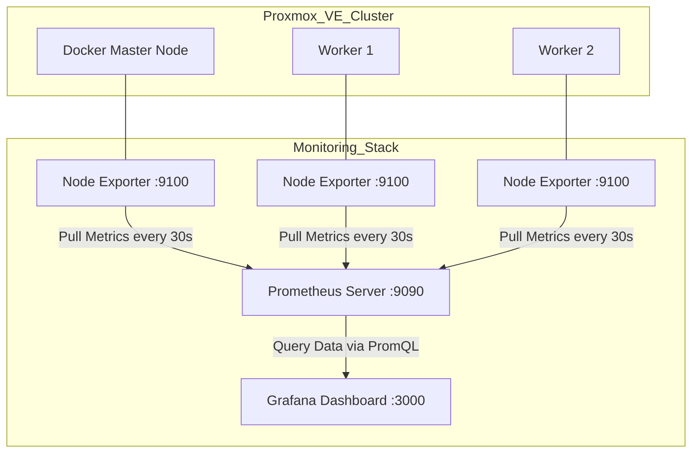

# Infrastructure
My Homelab Trial n Error
# 📊 Enterprise Monitoring Stack with LVM Storage Optimization


## 📖 Executive Summary
This project documents the architecture, deployment, and troubleshooting of a centralized monitoring stack for a 3-node Kubernetes (K3s) cluster. The primary objective was to achieve **full infrastructure observability** while ensuring **high availability** and preventing storage bottlenecks through dedicated Logical Volume Manager (LVM) partitioning.

## 🏗️ Architecture & Data Flow
The monitoring stack follows a pull-based architecture to ensure secure and scalable metrics collection.


## 🛠️ Tech Stack
| Component | Purpose |
| :--- | :--- |
| **Proxmox VE** | Hypervisor for VM provisioning |
| **K3s / Docker** | Container orchestration and runtime |
| **Prometheus** | Time-series database for metrics scraping |
| **Node Exporter** | Hardware and OS metrics exporter |
| **Grafana** | Data visualization and dashboarding |
| **Teleport** | 1 Way Gate Remote Server |
| **LVM** | Logical Volume Manager for dynamic storage allocation |

## 🚨 Challenge & Troubleshooting: The SIGBUS Error
During the initial deployment, the Prometheus server unexpectedly crashed with a `SIGBUS` error and refused to restart.

**Root Cause:** 
Upon checking with `df -h`, I found that the root partition (`/`) was at 100% capacity. Prometheus relies on memory-mapped files, and the lack of disk space caused the crash.

**The Fix:**
To prevent this from happening again, I decoupled the Prometheus data directory from the root filesystem using LVM:
1. Provisioned a dedicated disk and created a new Logical Volume (LV).
2. Formatted and mounted it to `/mnt/prometheus_data`.
3. Updated the Prometheus service configuration to point to the new storage path.
4. Implemented a data retention policy to automatically prune old metrics.

**Result:** Prometheus now runs with stable storage, and the root partition utilization remains healthy.

## 🔒 Security Hardening
- **Least Privilege:** Configured services to run as dedicated, non-root users.
- **Network Isolation:** Prometheus is bound to the internal network. Only Grafana is exposed for querying.
- **Firewall:** Configured `ufw` to strictly allow only necessary ports for internal scraping.

## 📸 Visual Proof


```
